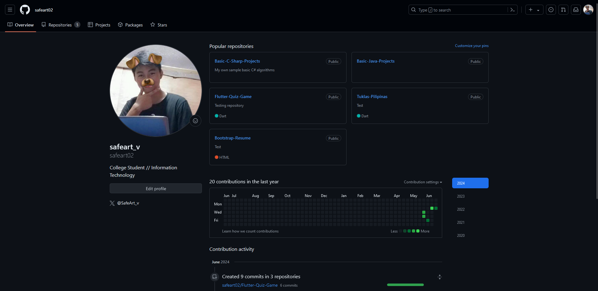

<!DOCTYPE html>
<html lang="en">

<head>
    <meta charset="UTF-8">
    <meta name="viewport" content="width=device-width, initial-scale=1">
    <title>Final HTML Project</title>
    <link rel="stylesheet" href="bootstrap.css">
    
    
    
    
</head>

<body>

    

        

            

                

                    <h1>PROJECT: DATABASE</h1>
                    <h3>Welcome to Ken Lester Taupo's Project Database!</h3>

                    <nav class="navbar navbar-expand-lg navbar-expand-md">
                        <a class="navbar-brand" href="#home">Home</a>
                        <button class="navbar-toggler" type="button" data-toggle="collapse" data-target="#navbarSupportedContent"
                            aria-controls="navbarSupportedContent" aria-expanded="false" aria-label="Toggle navigation">
                            
                        </button>
                        

                            <ul class="navbar-nav ml-auto">
                                <li class="nav-item">
                                    <a class="nav-link" href="#projects">Projects</a>
                                </li>
                                <li class="nav-item">
                                    <a class="nav-link" href="#github">GitHub</a>
                                </li>
                                <li class="nav-item">
                                    <a class="nav-link" href="#about">About</a>
                                </li>
                            </ul>
                        

                    </nav>

                

            

            

                
This is my archive for all the projects I made in ITEC87!

                

                    

                        <h2>This is made using Bootstrap 4!</h2>
                        

                    

                

                

                    

                        <h1 id="home">Home</h1>
                    

                

                

                    

                        

                            <h2>Projects</h2>
                        

                    

                    

                        

                            

                                
                                

                                    <h5 class="card-title" style="text-align: center;">Bootstrap Resume</h5>
                                    <button class="btn btn-primary btn-block" data-toggle="modal" data-target="#customModal1">Read more</button>
                                

                            

                        

                        

                            

                                
                                

                                    <h5 class="card-title" style="text-align: center;">Sari-sari Store</h5>
                                    <button class="btn btn-primary btn-block" data-toggle="modal" data-target="#customModal2">Read more</button>
                                

                            

                        

                    

                    

                        

                            

                                
                                

                                    <h5 class="card-title" style="text-align: center;">Certificate of Registration</h5>
                                    <button class="btn btn-primary btn-block" data-toggle="modal" data-target="#customModal3">Read more</button>
                                

                            

                        

                        

                            

                                
                                

                                    <h5 class="card-title" style="text-align: center;">Restaurant</h5>
                                    <button class="btn btn-primary btn-block" data-toggle="modal" data-target="#customModal4">Read more</button>
                                

                            

                        

                    

                

                

                    

                        

                            <h2>GitHub</h2>
                        

                    

                    

                        
                        

                            <a href="https://github.com/safeart02" target="_blank" class="btn btn-block btn-primary" type="button">Check out my GitHub!</a>
                        

                    

                

                

                    

                        

                            <h2>About</h2>
                        

                    

                

                

                    

                        

                            

                                
                            

                            

                                
"Hi! My name is Ken Lester Taupo and this is my archive! I hope you liked the archive I made! It is primarily using Bootstrap 4 as the format for the styles and it really helped 
                                    me in making this site pretty quick!"

                                
-someone who looks like they didn't get enough sleep.

                            

                        

                    

                

            

        

    

    

    

        

            

                <h5 class="modal-title" id="customModalLabel">Custom Modal Title</h5>
                <button type="button" class="close" data-dismiss="modal" aria-label="Close">
                    &times;
                </button>
            

            

                <iframe src="https://rawcdn.githack.com/safeart02/Bootstrap-Resume/3bbddf71757465b6e3621d84751ec54130c566e9/RESUME/resume.html" style="width: 100%; height: 80vh; border: none;"></iframe>
            

            

                <button type="button" class="btn btn-secondary" data-dismiss="modal">Close</button>
                <!-- Additional buttons or actions if needed -->
            

        

    

    

    

        

            

                <h5 class="modal-title" id="customModalLabel">Custom Modal Title</h5>
                <button type="button" class="close" data-dismiss="modal" aria-label="Close">
                    &times;
                </button>
            

            

                <iframe src="https://rawcdn.githack.com/safeart02/SariSariStore/ca38008fe2a2d602db487ab3ae760b9c2cace9b2/taupo_kenlester_sarisaristore_act/sarisariStore.html" style="width: 100%; height: 80vh; border: none;"></iframe>
            

            

                <button type="button" class="btn btn-secondary" data-dismiss="modal">Close</button>
                <!-- Additional buttons or actions if needed -->
            

        

    

    

    

        

            

                <h5 class="modal-title" id="customModalLabel">Custom Modal Title</h5>
                <button type="button" class="close" data-dismiss="modal" aria-label="Close">
                    &times;
                </button>
            

            

                <iframe src="https://rawcdn.githack.com/safeart02/COR/3058989abf7eb80c0778b80b09441d42c30551ca/COR/COR.html" style="width: 100%; height: 80vh; border: none;"></iframe>
            

            

                <button type="button" class="btn btn-secondary" data-dismiss="modal">Close</button>
                <!-- Additional buttons or actions if needed -->
            

        

    

    

    

        

            

                <h5 class="modal-title" id="customModalLabel">Custom Modal Title</h5>
                <button type="button" class="close" data-dismiss="modal" aria-label="Close">
                    &times;
                </button>
            

            

                <iframe src="https://rawcdn.githack.com/safeart02/Restaurant/1fd1646b88885e27e85c8e3949123919206fc48f/Restaurant/Taupo_Restaurant.html" style="width: 100%; height: 80vh; border: none;"></iframe>
            

            

                <button type="button" class="btn btn-secondary" data-dismiss="modal">Close</button>
                <!-- Additional buttons or actions if needed -->
            

        

    

	
	<!-- Add this script after your modal HTML -->

    <footer>
        
&copy; 2024 Ken Lester Taupo. All rights reserved.

    </footer>

</body>

</html>
